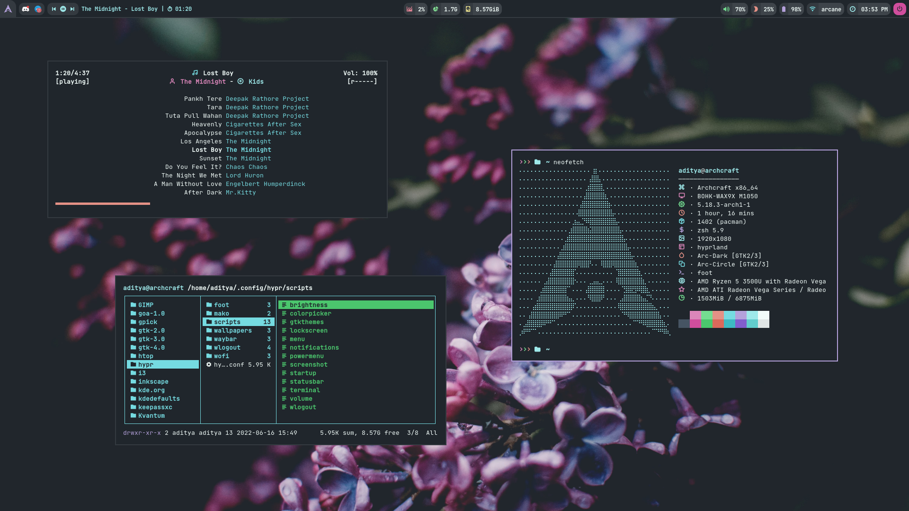
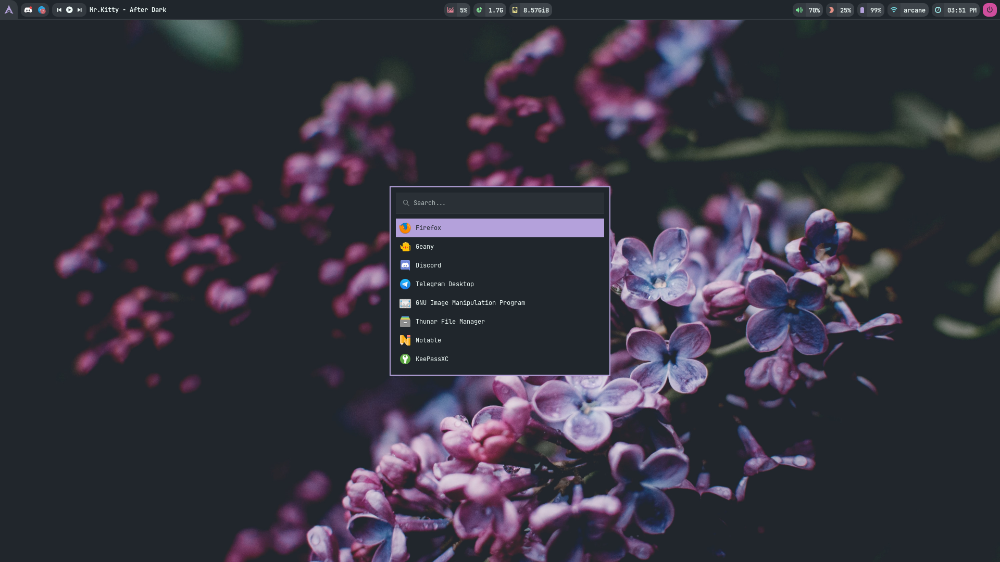
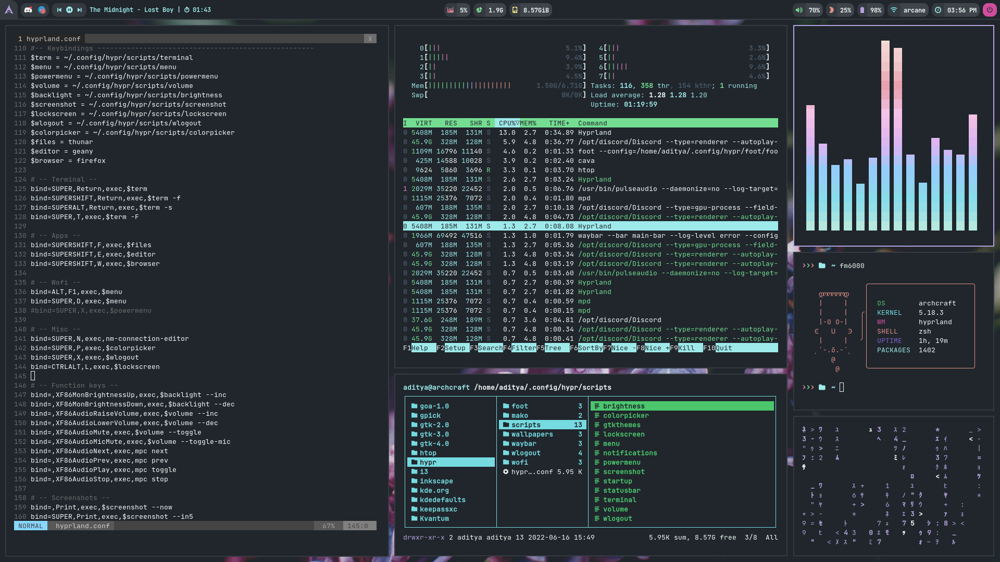
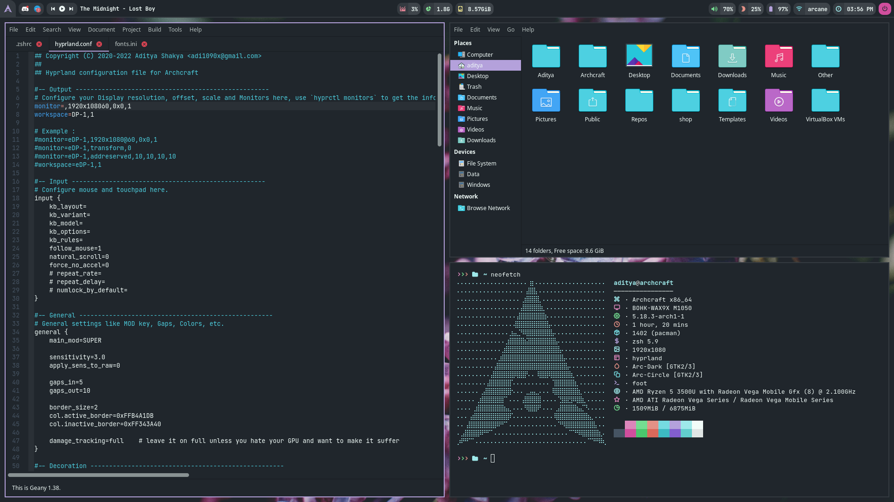
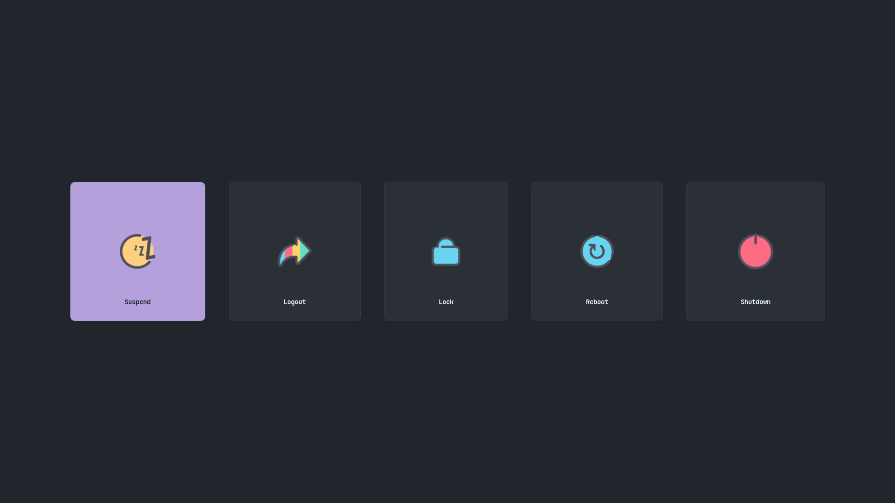
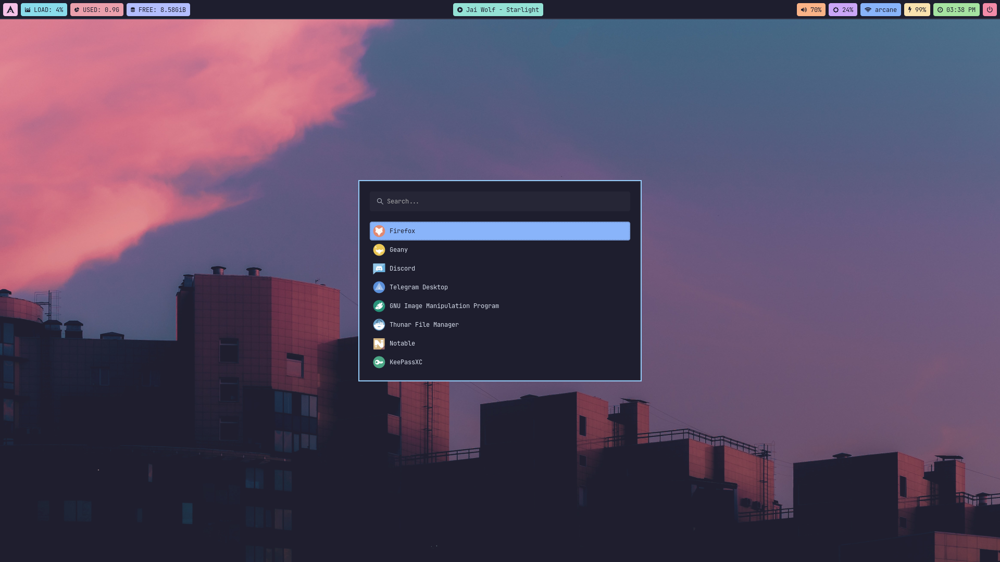
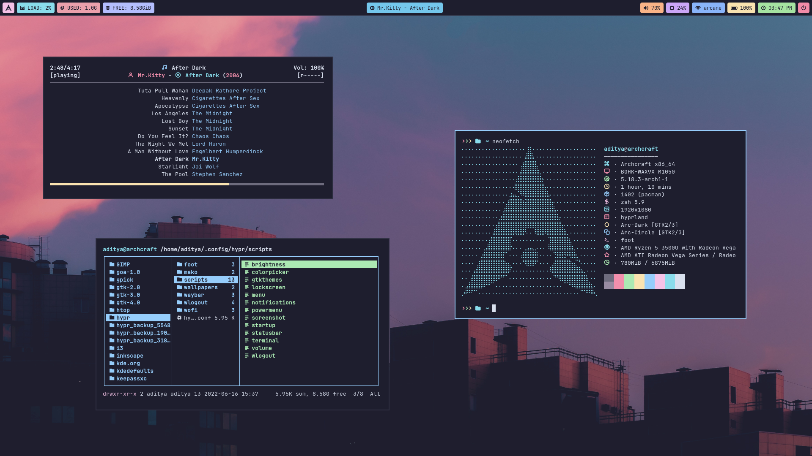
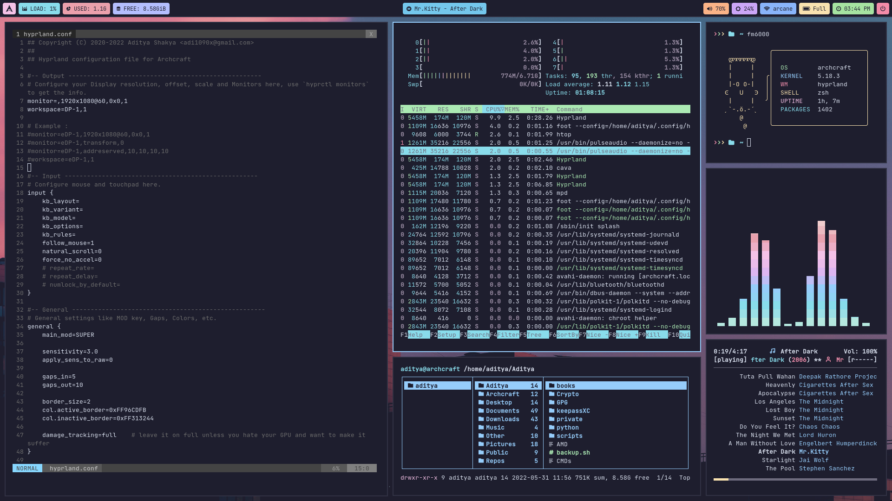
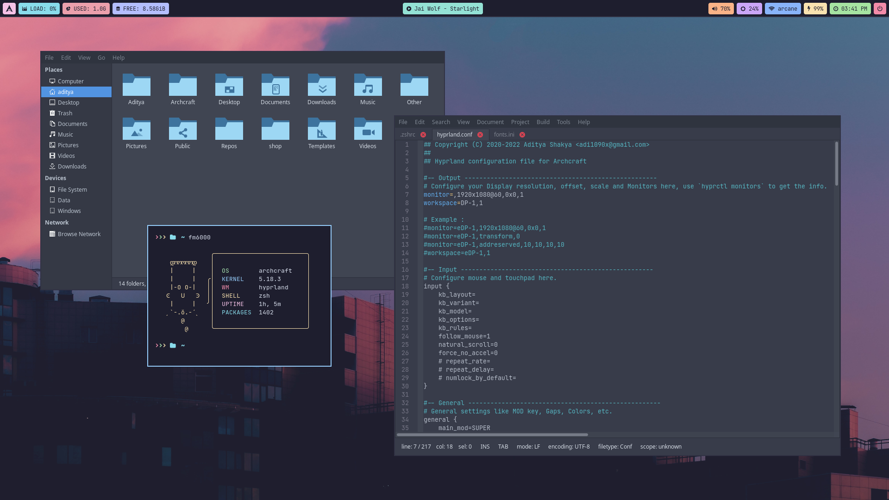
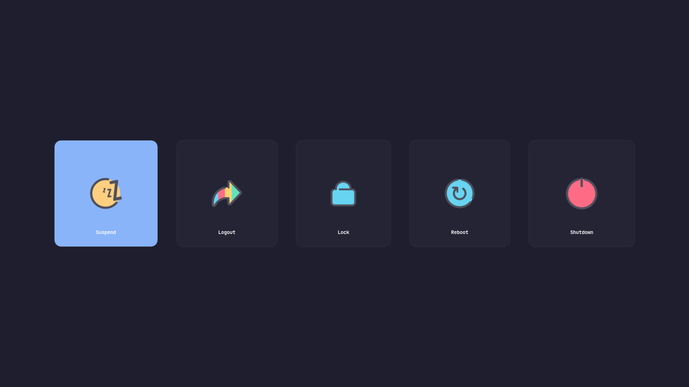

<h1 align="center">HYPRLAND</h1>

[](https://youtu.be/t6Zd2F7rtPw)

<p align="center">The ultimate Hyprland configuration (A Desktop Environment Like Experience)</p>

---

## Overview

[Hyprland](https://github.com/vaxerski/Hyprland) is a dynamic tiling Wayland compositor based on wlroots that doesn't sacrifice on its looks.

- **Operating System** : `Archcraft`
- **Window Manager** : `Hyprland (0.20.0)`
- **Status Bar** : `Waybar`
- **Launcher** : `Wofi`
- **Session Manager** : `Wlogout`
- **Notifications** : `Mako`
- **Terminal** : `Foot`
- **File Manager** : `Thunar`
- **Text Editor** : `Geany`
- **Web Browser** : `Firefox`

## Installation
- **Get the files from** : [Ko-fi :coffee:](https://ko-fi.com/s/71d0e298d9) <sup>[**`Why Paid`**](https://github.com/adi1090x/adi1090x/blob/master/WHY.md)</sup>
- Extract The file **hyprland.tar.gz** with : `tar -xzvf hyprland.tar.gz`
- If you are using **`Archcraft`** (`Required: 2023 or later`) as your OS, You can just install one of the provided package with : `sudo pacman -U archcraft-hyprland-2.0-0-any.pkg.tar.zst` or `sudo pacman -U archcraft-hyprland-catppuccin-2.0-0-any.pkg.tar.zst` whichever style you like.
- If you want to install this setup on _Arch Linux_ or on any _other distro_, follow the points below :
  - Install the following programs on your computer: [`hyprland`](https://github.com/vaxerski/Hyprland), `swaybg` `swayidle` `swaylock` `wlroots` `wl-clipboard` `waybar` `wofi` `foot` `mako` `grim` `slurp` `wf-recorder` `light` `yad` `thunar` `geany` `mpv` `mpd` `mpc` `viewnior` `imagemagick` `xfce-polkit` `xorg-xwayland` `xdg-desktop-portal-wlr`
  - After installing programs above, Create hypr directory in **`~/.config`** : `mkdir -p ~/.config/hypr`
  - Copy Everything from _`dotfiles/STYLE`_ to **`~/.config/hypr`** : `cp -r ./dotfiles/dark/* ~/.config/hypr/` 
  - Logout and login to your amazingly configured Hyprland WM.

> If you don't want to build hyprland, You can install **compiled hyprland binaries** from [hyprland releases](https://github.com/hyprwm/Hyprland/releases/tag/v0.20.0beta)
>```
>sudo install -Dm 755 dotfiles/hypr-bin/hyprctl /usr/bin/hyprctl
>sudo install -Dm 755 dotfiles/hypr-bin/Hyprland /usr/bin/Hyprland
>sudo install -Dm 755 dotfiles/hypr-bin/libwlroots.so.12032 /usr/lib/libwlroots.so.12032
>sudo install -Dm 644 dotfiles/hypr-bin/hyprland.desktop /usr/share/wayland-sessions/hyprland.desktop
>```

### Appearance

Install the following `theme`, `icon pack`, `cursors` and `fonts` for overall appearance.

- GTK Theme : [Manhattan gtk theme](https://github.com/archcraft-os/archcraft-themes/tree/main/archcraft-gtk-theme-manhattan)
- Icon Theme : [Luv icon theme](https://github.com/Nitrux/luv-icon-theme)
- Cursor Theme : [Qogir cursor theme](https://www.gnome-look.org/p/1366182/)
- Fonts : [JetBrainsMono Nerd Font](https://github.com/ryanoasis/nerd-fonts/releases/download/v2.1.0/JetBrainsMono.zip), [Iosevka Nerd Font](https://github.com/ryanoasis/nerd-fonts/releases/download/v2.1.0/Iosevka.zip), [Icomoon Feather](https://github.com/archcraft-os/archcraft-packages/blob/main/archcraft-fonts/files/icon-fonts/Icomoon-Feather.ttf), [Archcraft](https://github.com/archcraft-os/archcraft-packages/blob/main/archcraft-fonts/files/icon-fonts/archcraft.ttf)

## Config Structure
```
~/.config
└── hypr               : Hyprland config directory
    ├── foot           : Terminal config
    ├── mako           : Notification daemon config
    │   └── icons      : Notification icons
    ├── scripts        : Various scripts for functionality
    ├── wallpapers     : Wallpapers
    ├── waybar         : Statusbar config
    ├── wlogout        : Wlogout config
    │   └── icons      : Session icons
    ├── wofi           : Launcher config
    ├── hyprland.conf  : Hyprland config file
    └── hyprtheme.conf : Colors and theme elements file
```

## Keybindings

| Keys | Action |
| --- | --- |
| <kbd>super + Return</kbd> | Open terminal |
| <kbd>super + shift + Return</kbd> | Open floating terminal |
| <kbd>super + alt + Return</kbd> | Open terminal with selected geometry |
| <kbd>super + T</kbd> | Open full-screen terminal with big fonts |
| <kbd>super + shift + F</kbd> | Open file manager |
| <kbd>super + shift + E</kbd> | Open text editor |
| <kbd>super + shift + W</kbd> | Open web browser|
| <kbd>super</kbd>, <kbd>super + D</kbd> | Run app launcher |
| <kbd>super + X</kbd> | Run powermenu |
| <kbd>super + N</kbd> | Open network manager |
| <kbd>super + P</kbd> | Run colorpicker |
| <kbd>super + C/Q</kbd> | Kill active window |
| <kbd>ctrl + alt + L</kbd> | Run lockscreen |
| <kbd>ctrl + alt + Delete</kbd> | Exit Hyprland instantly |
| <kbd>super + F</kbd> | Toggle fullscreen mode |
| <kbd>super + Space</kbd> | Toggle floating mode |
| <kbd>super + S</kbd> | Toggle pseudo mode |
| <kbd>super + Left / Right / Up / Down</kbd> | Change focus of the container |
| <kbd>super + shift + Left / Right / Up / Down</kbd> | Move active container directionally |
| <kbd>super + ctrl + Left / Right / Up / Down</kbd> | Resize active container |
| <kbd>super + alt + Left / Right / Up / Down</kbd> | Move floationg container directionally |
| <kbd>super + Tab</kbd> | Cycle between container |
| <kbd>super + 1,2..8</kbd> | Change workspace/tag from 1 to 8 |
| <kbd>super + shift + 1,2..8</kbd> | Move active container to repective workspace/tag |
| <kbd>super + ctrl + F</kbd> | Toggle All floating mode |
| <kbd>super + ctrl + S</kbd> | Toggle All pseudo mode |
| <kbd>super + shift + P</kbd> | Pin floating container |
| <kbd>super + shift + S</kbd> | Swap next container |
| <kbd>super + G</kbd> | Toggle Group Mode |
| <kbd>super + H</kbd> | Change active group container to left |
| <kbd>super + L</kbd> | Change active group container to right |

## Screenshots

**`Dark Version`**
| Desktop (wofi) | Floating | Tiled | Thunar, Geany | Wlogout |
| --- | --- | --- | --- | --- |
||||||

**`Catppuccin Version`**
| Desktop (wofi) | Floating | Tiled | Thunar, Geany | Wlogout |
| --- | --- | --- | --- | --- |
||||||


## FYI
- May or may not work on [**`Nvidia`**](https://wiki.archlinux.org/title/Sway#Installation), See [wayland requirements](https://wiki.archlinux.org/title/wayland#Requirements).
- Follow the [hyprland wiki](https://wiki.hyprland.org/Nvidia/) to make Hyprland possibly work on Nvidia
- Thank you for your support.

---

### See Also

| [**`archcraft-sway`**](https://github.com/archcraft-os/archcraft-sway) | [**`archcraft-wayfire`**](https://github.com/archcraft-os/archcraft-wayfire) | [**`archcraft-river`**](https://github.com/archcraft-os/archcraft-river) | [**`archcraft-newm`**](https://github.com/archcraft-os/archcraft-newm) |
| --- | --- | --- | --- |
|[](https://github.com/archcraft-os/archcraft-sway)|[](https://github.com/archcraft-os/archcraft-wayfire)|[](https://github.com/archcraft-os/archcraft-river)|[](https://github.com/archcraft-os/archcraft-newm)|
